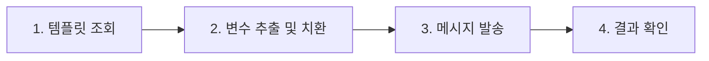

<div align="center">

# 📱 비즈메시지 API 사용 가이드

**CertiLife 카카오톡 알림톡 발송 API**

[](https://github.com)
[](https://api.certi.life)
[](https://certi.life)

</div>

---

## 📑 목차

- [개요](#-개요)
- [시작하기](#-시작하기)
  - [인증](#-인증)
  - [기본 URL](#-기본-url)
- [API 레퍼런스](#-api-레퍼런스)
  - [1️⃣ 템플릿 조회 API](#1️⃣-템플릿-조회-api)
  - [2️⃣ 메시지 발송 API](#2️⃣-메시지-발송-api)
- [워크플로우](#-워크플로우)
- [에러 처리](#️-에러-처리)
- [사용 팁](#-사용-팁)
- [지원](#-지원)

---

## 📋 개요

CertiLife 비즈메시지 API는 **카카오톡 알림톡**을 프로그래밍 방식으로 발송할 수 있는 RESTful API입니다.

### 🎯 주요 기능

| 기능               | 설명                                                       |
| ------------------ | ---------------------------------------------------------- |
| **🔍 템플릿 조회** | 등록된 카카오톡 알림톡 템플릿의 상세 정보를 조회합니다     |
| **📤 메시지 발송** | 조회한 템플릿을 기반으로 실제 카카오톡 알림톡을 발송합니다 |
| **🔄 대체 발송**   | 알림톡 발송 실패 시 SMS로 자동 전환 가능                   |
| **📊 에러 추적**   | 상세한 에러 코드로 문제 진단 및 해결 지원                  |

---

## 🚀 시작하기

### 🔑 인증

모든 API 요청은 **HTTP Header**에 API Key를 포함해야 합니다.

<table>
<tr>
<td>

**Header 설정**

```http
X-Api-Key: {APIKEY}
```

</td>
<td>

**cURL 예시**

```bash
curl -H "X-Api-Key: YOUR_API_KEY" \
  https://api.certi.life/bizmsg/...
```

</td>
</tr>
</table>

> **📌 참고**: API Key는 보안이 중요합니다. 코드 저장소에 직접 포함하지 마세요.

### 🌐 기본 URL

```
https://api.certi.life
```

---

## 📚 API 레퍼런스

## 1️⃣ 템플릿 조회 API

<div style="background: #e7f3ff; padding: 15px; border-left: 4px solid #0969da; margin: 10px 0; color: #0a3069;">
등록된 카카오톡 알림톡 템플릿의 상세 정보를 가져오는 API입니다.

메시지를 발송하기 전에 **템플릿 내용, 버튼 정보, 필요한 변수**를 미리 확인할 때 사용합니다.

</div>

### 📍 엔드포인트

```http
GET /bizmsg/resell/templates/{templateCode}?channelId={channelId}
```

### 📥 요청 파라미터

#### 📌 Path Parameter

| 파라미터       | 타입     | 필수 | 설명               | 예시                      |
| -------------- | -------- | :--: | ------------------ | ------------------------- |
| `templateCode` | `string` |  ✅  | 조회할 템플릿 코드 | `음성봇_병원예약_TEST_V1` |

#### 🔍 Query Parameter

| 파라미터    | 타입     | 필수 | 설명    | 기본값       |
| ----------- | -------- | :--: | ------- | ------------ |
| `channelId` | `string` |  ❌  | 채널 ID | 첫 번째 채널 |

**예시**: `@서티라이프cs`

#### 🔐 Header

| 헤더        | 타입     | 필수 | 설명        |
| ----------- | -------- | :--: | ----------- |
| `X-Api-Key` | `string` |  ✅  | API 인증 키 |

### ⚠️ 중요: URL 인코딩 필수

<div style="background: #fff4ce; padding: 15px; border-left: 4px solid #ff9800; margin: 10px 0; color: #663c00; font-weight: 500;">
**한글 템플릿 코드는 반드시 URL 인코딩이 필요합니다!**

템플릿 코드에 한글이 포함된 경우, 인코딩하지 않으면 서버에서 템플릿을 인식하지 못합니다.

</div>

**✅ 올바른 예시**

```bash
# 정상 작동 - URL 인코딩 적용
curl "https://api.certi.life/bizmsg/resell/templates/%EC%9D%8C%EC%84%B1%EB%B4%87_%EB%B3%91%EC%9B%90%EC%98%88%EC%95%BD_TEST_V1?channelId=@서티라이프cs"
```

**❌ 잘못된 예시**

```bash
# 작동하지 않음 - 한글 인코딩 안됨
curl "https://api.certi.life/bizmsg/resell/templates/음성봇_병원예약_TEST_V1?channelId=@서티라이프cs"
```

<details>
<summary><b>💻 언어별 인코딩 방법</b></summary>

**JavaScript**

```javascript
const templateCode = '음성봇_병원예약_TEST_V1';
const encoded = encodeURIComponent(templateCode);
```

**Python**

```python
from urllib.parse import quote
template_code = '음성봇_병원예약_TEST_V1'
encoded = quote(template_code)
```

**Java**

```java
String templateCode = "음성봇_병원예약_TEST_V1";
String encoded = URLEncoder.encode(templateCode, "UTF-8");
```

</details>

### 📤 요청 예시

<details>
<summary><b>🟦 JavaScript (fetch)</b></summary>

```javascript
const templateCode = '음성봇_병원예약_TEST_V1';
const channelId = '@서티라이프cs';

const response = await fetch(
  `https://api.certi.life/bizmsg/resell/templates/${encodeURIComponent(
    templateCode,
  )}?channelId=${encodeURIComponent(channelId)}`,
  {
    method: 'GET',
    headers: {
      'X-Api-Key':
        '{apiKey}',
    },
  },
);

const data = await response.json();
console.log(data);
```

</details>

<details>
<summary><b>🐍 Python (requests)</b></summary>

```python
import requests

template_code = '음성봇_병원예약_TEST_V1'
channel_id = '@서티라이프cs'

url = f'https://api.certi.life/bizmsg/resell/templates/{template_code}'
params = {'channelId': channel_id}
headers = {'X-Api-Key': '{apiKey}'}

response = requests.get(url, params=params, headers=headers)
data = response.json()
print(data)
```

</details>

<details>
<summary><b>⚡ cURL</b></summary>

```bash
curl -X GET \
  "https://api.certi.life/bizmsg/resell/templates/%EC%9D%8C%EC%84%B1%EB%B4%87_%EB%B3%91%EC%9B%90%EC%98%88%EC%95%BD_TEST_V1?channelId=@서티라이프cs" \
  -H "X-Api-Key: {apiKey}"
```

</details>

### 📨 응답 예시

**✅ 성공 (200 OK)**

```json
{
  "success": true,
  "message": "Resell 템플릿 상세 조회 성공",
  "data": {
    "templateCode": "음성봇_병원예약_TEST_V1",
    "templateName": "음성봇_병원예약_TEST_V1",
    "templateContent": "편한치과 AI봇과의 상담이 종료되었습니다.\n추가로 궁금한 점이 있으시면 언제든지 편하게 문의해주세요 😊\n병원 예약도 아래 링크를 통해 간편하게 하실 수 있어요.\n\n• 운영시간: 오전 10시 ~ 오후 7시 (주말·공휴일 휴무)\n• 점심시간: 오후 12시 30분 ~ 1시 30분\n• 전화번호: 02-2038-2622\n\n감사합니다",
    "templateImageName": "센터플로우_병원예약_V1.png",
    "templateImageUrl": "https://mud-kage.kakao.com/dn/bQZayi/btsQ9WywOCN/GMY6ELIg1LqVWPzc1ivqxK/img_l.jpg",
    "templateHeader": null,
    "securityFlag": false,
    "templateStatus": "A",
    "kepStatus": "O",
    "templateMessageType": "BA",
    "templateExtra": null,
    "templateAd": null,
    "templateTitle": null,
    "templateSubtitle": null,
    "templateEmphasizeType": "IMAGE",
    "categoryCode": "004001",
    "templateDormant": false,
    "templateBlock": false,
    "buttons": [
      {
        "ordering": 1,
        "name": "편한치과 진료 예약하기",
        "linkType": "WL",
        "linkMo": "https://customer.certi.life/hospital/5/편한치과-부산광역시-영도구-동삼동",
        "linkPc": "https://customer.certi.life/hospital/5/편한치과-부산광역시-영도구-동삼동"
      }
    ],
    "quickReplies": null,
    "templateItemHighlight": null,
    "templateItem": null,
    "templateComments": []
  }
}
```

**❌ 실패 (200 OK)**

> ⚠️ **중요**: 실패 응답도 HTTP 상태 코드 200 OK로 반환됩니다.
> 최상위 `success`가 `true`여도 **`data` 필드가 비어있는지 확인**해야 합니다!

```json
{
  "success": true,
  "message": "Resell 템플릿 상세 조회 성공",
  "data": null
}
```

> 📌 **실패 판단 기준**: `data` 필드가 `null`이거나 비어있으면 템플릿을 찾을 수 없는 경우입니다.
>
> - 잘못된 템플릿 코드
> - 잘못된 채널 ID
> - 해당 채널에 등록되지 않은 템플릿

### 📋 응답 필드 설명

<details>
<summary><b>펼쳐서 상세 필드 확인</b></summary>

| 필드                         | 타입               | 설명                                                                         |
| ---------------------------- | ------------------ | ---------------------------------------------------------------------------- |
| `success`                    | `boolean`          | 최상위 요청 성공 여부 (항상 `true`)                                          |
| `message`                    | `string`           | 최상위 응답 메시지                                                           |
| `data`                       | `object` \| `null` | **템플릿 데이터** (이 필드가 `null`이면 실패!)                               |
| `data.templateCode`          | `string`           | 템플릿 코드                                                                  |
| `data.templateName`          | `string`           | 템플릿 이름                                                                  |
| `data.templateContent`       | `string`           | 템플릿 본문 (변수 포함)                                                      |
| `data.templateImageName`     | `string`           | 템플릿 이미지 파일명                                                         |
| `data.templateImageUrl`      | `string`           | 템플릿 이미지 URL                                                            |
| `data.templateHeader`        | `string` \| `null` | 템플릿 헤더                                                                  |
| `data.securityFlag`          | `boolean`          | 보안 템플릿 여부                                                             |
| `data.templateStatus`        | `string`           | 템플릿 상태 (`A`: 승인됨)                                                    |
| `data.kepStatus`             | `string`           | KEP 상태 (`O`: 사용 가능)                                                    |
| `data.templateMessageType`   | `string`           | 메시지 타입 (`BA`: 기본형, `EX`: 부가정보형, `AD`: 광고추가형, `MI`: 복합형) |
| `data.templateExtra`         | `string` \| `null` | 부가 정보                                                                    |
| `data.templateAd`            | `string` \| `null` | 광고 내용                                                                    |
| `data.templateTitle`         | `string` \| `null` | 강조 표시 타이틀                                                             |
| `data.templateSubtitle`      | `string` \| `null` | 강조 표시 서브타이틀                                                         |
| `data.templateEmphasizeType` | `string`           | 강조 표시 타입 (`IMAGE`: 이미지형)                                           |
| `data.categoryCode`          | `string`           | 카테고리 코드                                                                |
| `data.templateDormant`       | `boolean`          | 휴면 템플릿 여부                                                             |
| `data.templateBlock`         | `boolean`          | 차단 템플릿 여부                                                             |
| `data.buttons`               | `array`            | 버튼 정보 배열                                                               |
| `data.buttons[].ordering`    | `number`           | 버튼 순서                                                                    |
| `data.buttons[].name`        | `string`           | 버튼 이름                                                                    |
| `data.buttons[].linkType`    | `string`           | 링크 타입 (`WL`: 웹링크, `AL`: 앱링크)                                       |
| `data.buttons[].linkMo`      | `string`           | 모바일 링크 URL                                                              |
| `data.buttons[].linkPc`      | `string`           | PC 링크 URL                                                                  |
| `data.quickReplies`          | `array` \| `null`  | 바로연결 정보                                                                |
| `data.templateItemHighlight` | `object` \| `null` | 아이템 하이라이트                                                            |
| `data.templateItem`          | `object` \| `null` | 아이템 정보                                                                  |
| `data.templateComments`      | `array`            | 템플릿 코멘트                                                                |

**실패 판단 방법:**

```javascript
// ❌ HTTP 상태 코드로는 판단 불가 (항상 200 OK)
// ❌ response.success로는 판단 불가 (항상 true)
// ✅ data 필드가 null인지 확인
const isSuccess = response.data !== null && response.data !== undefined;
```

</details>

---

## 2️⃣ 메시지 발송 API

<div style="background: #e7f3ff; padding: 15px; border-left: 4px solid #0969da; margin: 10px 0; color: #0a3069;">

템플릿 정보를 기반으로 실제 카카오톡 알림톡을 발송하는 API입니다.

고객에게 **예약 확인, 알림, 안내 메시지** 등을 실시간으로 전송할 때 사용합니다.

</div>

### 📍 엔드포인트

```http
POST /bizmsg/send/kakao
```

### 📥 요청 파라미터

#### 🔐 Header

| 헤더           | 타입     | 필수 | 설명               |
| -------------- | -------- | :--: | ------------------ |
| `X-Api-Key`    | `string` |  ✅  | API 인증 키        |
| `Content-Type` | `string` |  ✅  | `application/json` |

#### 📦 Body (JSON)

| 필드          | 타입     | 필수 | 설명                                                    | 예시            |
| ------------- | -------- | :--: | ------------------------------------------------------- | --------------- |
| `phoneNumber` | `string` |  ✅  | 수신자 전화번호 (하이픈 없이)                           | `01012345678`   |
| `channelId`   | `string` |  ❌  | 채널 ID                                                 | `@서티라이프cs` |
| `data`        | `object` |  ✅  | 메시지 발송 데이터 (템플릿 조회 API로 얻은 데이터 기반) | 👇 아래 참조    |

> **💡 중요**: `data` 객체는 **템플릿 조회 API**에서 받아온 템플릿 정보를 기반으로 구성합니다.
>
> - 템플릿에 **변수(`#{변수명}`)가 있는 경우**: 실제 값으로 치환한 후 전송
> - 템플릿에 **변수가 없는 경우**: 조회한 내용을 그대로 사용

**`data` 객체 필드:**

| 필드                  | 타입      | 필수 | 설명                                                                    |
| --------------------- | --------- | :--: | ----------------------------------------------------------------------- |
| `templateCode`        | `string`  |  ✅  | 템플릿 코드                                                             |
| `templateContent`     | `string`  |  ✅  | 메시지 본문 (변수가 있으면 치환 완료된 내용, 없으면 조회한 내용 그대로) |
| `templateMessageType` | `string`  |  ✅  | 메시지 타입 (`BA`, `EX`, `AD`, `MI`)                                    |
| `templateName`        | `string`  |  ❌  | 템플릿 이름                                                             |
| `templateImageUrl`    | `string`  |  ❌  | 템플릿 이미지 URL                                                       |
| `buttons`             | `array`   |  ❌  | 버튼 정보 배열                                                          |
| `senderNo`            | `string`  |  ❌  | 발신번호                                                                |
| `fallBackYn`          | `boolean` |  ❌  | 대체 발송 여부 (기본: `false`)                                          |

### 📤 요청 예시

<details>
<summary><b>🟦 JavaScript (fetch)</b></summary>

```javascript
const requestBody = {
  phoneNumber: '01012345678',
  channelId: '@서티라이프cs',
  data: {
    templateCode: '음성봇_병원예약_TEST_V1',
    templateName: '음성봇 병원예약 테스트',
    templateContent:
      '안녕하세요, 서울대병원입니다.\n\n예약이 완료되었습니다.\n- 예약일시: 2025-10-20 14:00\n- 진료과: 정형외과\n\n감사합니다.',
    templateMessageType: 'BA',
    buttons: [
      {
        ordering: 1,
        name: '예약 확인',
        linkType: 'WL',
        linkMo: 'https://example.com/appointment/12345',
        linkPc: 'https://example.com/appointment/12345',
      },
    ],
    fallBackYn: false,
  },
};

const response = await fetch('https://api.certi.life/bizmsg/send/kakao', {
  method: 'POST',
  headers: {
    'X-Api-Key': '{apiKey}',
    'Content-Type': 'application/json',
  },
  body: JSON.stringify(requestBody),
});

const data = await response.json();
console.log(data);
```

</details>

<details>
<summary><b>🐍 Python (requests)</b></summary>

```python
import requests
import json

url = 'https://api.certi.life/bizmsg/send/kakao'
headers = {
    'X-Api-Key': '{apiKey}',
    'Content-Type': 'application/json'
}
payload = {
    'phoneNumber': '01012345678',
    'channelId': '@서티라이프cs',
    'data': {
        'templateCode': '음성봇_병원예약_TEST_V1',
        'templateName': '음성봇 병원예약 테스트',
        'templateContent': '안녕하세요, 서울대병원입니다.\n\n예약이 완료되었습니다.\n- 예약일시: 2025-10-20 14:00\n- 진료과: 정형외과\n\n감사합니다.',
        'templateMessageType': 'BA',
        'buttons': [
            {
                'ordering': 1,
                'name': '예약 확인',
                'linkType': 'WL',
                'linkMo': 'https://example.com/appointment/12345',
                'linkPc': 'https://example.com/appointment/12345'
            }
        ],
        'fallBackYn': False
    }
}

response = requests.post(url, headers=headers, data=json.dumps(payload))
data = response.json()
print(data)
```

</details>

<details>
<summary><b>⚡ cURL</b></summary>

```bash
curl -X POST \
  "https://api.certi.life/bizmsg/send/kakao" \
  -H "X-Api-Key: {apiKey}" \
  -H "Content-Type: application/json" \
  -d '{
    "phoneNumber": "01012345678",
    "channelId": "@서티라이프cs",
    "data": {
      "templateCode": "음성봇_병원예약_TEST_V1",
      "templateName": "음성봇 병원예약 테스트",
      "templateContent": "안녕하세요, 서울대병원입니다.\n\n예약이 완료되었습니다.\n- 예약일시: 2025-10-20 14:00\n- 진료과: 정형외과\n\n감사합니다.",
      "templateMessageType": "BA",
      "buttons": [
        {
          "ordering": 1,
          "name": "예약 확인",
          "linkType": "WL",
          "linkMo": "https://example.com/appointment/12345",
          "linkPc": "https://example.com/appointment/12345"
        }
      ],
      "fallBackYn": false
    }
  }'
```

</details>

### 📨 응답 예시

**✅ 성공 (201 Created)**

```json
{
  "success": true,
  "message": "카카오 메시지 발송 성공",
  "data": {
    "success": true,
    "data": {
      "code": "200",
      "result": {
        "detail_code": "0000",
        "detail_message": "성공"
      },
      "uid": "2510171006447344CkPTkRyQbed5je",
      "cid": "ffea02e0e758a4b613b4cd5152b437ea7b302cbe"
    }
  }
}
```

**❌ 실패 (201 Created)**

> ⚠️ **중요**: 실패 응답도 HTTP 상태 코드 201로 반환됩니다.
> 최상위 `success`가 `true`여도 **`data.code`가 에러 코드인지 반드시 확인**해야 합니다!

```json
{
  "success": true,
  "message": "카카오 메시지 발송 성공",
  "data": {
    "success": false,
    "code": "510",
    "detail_code": "3015",
    "detail_message": "TemplateNotFoundException(음성봇_병원예약_TEST_V1)",
    "data": {
      "code": "510",
      "result": {
        "detail_code": "3015",
        "detail_message": "TemplateNotFoundException(음성봇_병원예약_TEST_V1)"
      },
      "uid": "251017100705994+BhPS7+nQh6GLhN",
      "cid": "eec1352d8dddfd56c3a9efd8ccaa28e778bb38e4"
    }
  }
}

```

---

## 🔄 워크플로우

전체 메시지 발송 프로세스를 단계별로 안내합니다.



### 🎯 비즈니스 흐름 개요

카카오톡 알림톡 발송은 다음과 같은 프로세스로 진행됩니다:

1. **템플릿 조회**: 발송하려는 템플릿의 상세 정보를 조회합니다
2. **템플릿 처리** (선택사항): 템플릿 내 변수(`#{변수명}`)가 있는 경우, 실제 값으로 매핑합니다
3. **메시지 발송**: 템플릿 데이터를 발송 API에 전송합니다

> **💡 참고**: 템플릿에 변수가 없는 경우 2단계를 생략하고 조회한 템플릿 내용을 그대로 사용할 수 있습니다.

---

### 🔹 1단계: 템플릿 조회

먼저 **템플릿 조회 API**를 호출하여 발송할 템플릿의 정보를 가져옵니다.

```javascript
// 템플릿 조회
const templateResponse = await fetch(
  `https://api.certi.life/bizmsg/resell/templates/${encodeURIComponent(
    '음성봇_병원예약_TEST_V1',
  )}?channelId=@서티라이프cs`,
  {
    headers: {
      'X-Api-Key':
        '{apiKey}',
    },
  },
);

const templateData = await templateResponse.json();
console.log('템플릿 정보:', templateData.data);

// 응답 예시:
// {
//   templateCode: "음성봇_병원예약_TEST_V1",
//   templateContent: "안녕하세요, #{hospital_name}입니다.\n예약일시: #{appointment_date}",
//   templateMessageType: "BA",
//   buttons: [...]
// }
```

### 🔹 2단계: 템플릿 변수 추출 및 치환 (선택사항)

> **⚠️ 이 단계는 템플릿에 변수가 있는 경우에만 필요합니다.**
> 변수가 없는 템플릿은 조회한 내용을 그대로 사용하여 바로 3단계로 이동할 수 있습니다.

템플릿의 `templateContent`에 **변수(`#{변수명}`)가 포함된 경우**, 실제 값으로 치환합니다.

<div style="background: #fff4ce; padding: 15px; border-left: 4px solid #ff9800; margin: 10px 0; color: #663c00; font-weight: 500;">

**변수 형식**: `#{변수명}` (예: `#{giftName}`, `#{expireDate}`, `#{hospital_name}`)

템플릿에 변수가 포함된 경우, 변수를 추출하고 실제 값으로 매핑한 후 발송해야 합니다.

</div>

**변수 추출 및 치환 예시:**

```javascript
// 1️⃣ 템플릿 내용에서 변수 추출
let content = templateData.data.templateContent;
// 예: "안녕하세요, #{hospital_name}입니다.\n예약일시: #{appointment_date}\n진료과: #{department}"

// 2️⃣ 정규식으로 모든 변수 찾기 (선택사항)
const variables = content.match(/#\{[^}]+\}/g);
console.log('발견된 변수:', variables);
// 결과: ['#{hospital_name}', '#{appointment_date}', '#{department}']

// 3️⃣ 변수를 실제 값으로 치환
content = content.replace('#{hospital_name}', '서울대병원');
content = content.replace('#{appointment_date}', '2025-10-20 14:00');
content = content.replace('#{department}', '정형외과');

console.log('치환된 메시지:', content);
// 결과: "안녕하세요, 서울대병원입니다.\n예약일시: 2025-10-20 14:00\n진료과: 정형외과"
```

**상품 정보 변수 예시:**

```javascript
// 템플릿 예시
const template = `
선물이 도착했습니다!

■ 상품명: #{giftName}
■ 유효기간: #{expireDate}

감사합니다.
`;

// 변수 치환
let message = template
  .replace('#{giftName}', '스타벅스 아메리카노')
  .replace('#{expireDate}', '2025-12-31');

console.log(message);
// 결과:
// 선물이 도착했습니다!
//
// ■ 상품명: 스타벅스 아메리카노
// ■ 유효기간: 2025-12-31
//
// 감사합니다.
```

### 🔹 3단계: 메시지 발송

**템플릿 조회 API**에서 받은 데이터를 **메시지 발송 API**에 전송합니다.

**경우 1: 변수가 있는 템플릿 (변수 치환 완료)**

```javascript
// 발송 API 호출
const sendResponse = await fetch('https://api.certi.life/bizmsg/send/kakao', {
  method: 'POST',
  headers: {
    'X-Api-Key': '{apiKey}',
    'Content-Type': 'application/json',
  },
  body: JSON.stringify({
    phoneNumber: '01012345678',
    channelId: '@서티라이프cs',
    data: {
      // 템플릿 조회 API에서 받은 데이터 기반
      templateCode: templateData.data.templateCode,
      templateName: templateData.data.templateName,
      templateMessageType: templateData.data.templateMessageType,

      // ✅ 변수 치환이 완료된 내용 사용
      templateContent: content,

      // 템플릿 조회 API에서 받은 버튼 정보
      buttons: templateData.data.buttons,
    },
  }),
});

const sendResult = await sendResponse.json();
console.log('발송 결과:', sendResult);
```

**경우 2: 변수가 없는 템플릿 (조회한 내용 그대로 사용)**

```javascript
// 발송 API 호출 (변수 치환 생략)
const sendResponse = await fetch('https://api.certi.life/bizmsg/send/kakao', {
  method: 'POST',
  headers: {
    'X-Api-Key': '{apiKey}',
    'Content-Type': 'application/json',
  },
  body: JSON.stringify({
    phoneNumber: '01012345678',
    channelId: '@서티라이프cs',
    data: {
      templateCode: templateData.data.templateCode,
      templateName: templateData.data.templateName,
      templateMessageType: templateData.data.templateMessageType,

      // ✅ 조회한 템플릿 내용을 그대로 사용
      templateContent: templateData.data.templateContent,

      buttons: templateData.data.buttons,
    },
  }),
});

const sendResult = await sendResponse.json();
console.log('발송 결과:', sendResult);
```

> **💡 핵심**:
>
> - 변수가 **있는** 템플릿: `templateContent`에 변수 치환을 완료한 값을 사용
> - 변수가 **없는** 템플릿: 조회한 `templateContent`를 그대로 사용

### 🔹 4단계: 결과 확인

발송 후 수신자의 카카오톡에서 메시지를 확인합니다.

---

## ⚠️ 에러 처리

### 🚨 중요: 성공/실패 판단 방법

> ⚠️ **주의**: 이 API는 **HTTP 상태 코드만으로는 성공/실패를 판단할 수 없습니다!**

**템플릿 조회 API:**

```javascript
// ✅ 올바른 판단 방법
const response = await fetch(url);
const data = await response.json();

// HTTP 200 OK여도 실패일 수 있음!
const isSuccess = data.data !== null && data.data !== undefined;

if (isSuccess) {
  // 성공: data에 템플릿 정보가 있음
  const templateInfo = data.data;
  console.log('템플릿 코드:', templateInfo.templateCode);
} else {
  // 실패: data가 null (템플릿을 찾을 수 없음)
  console.error('템플릿 조회 실패');
}
```

**메시지 발송 API:**

```javascript
// ✅ 올바른 판단 방법
const response = await fetch(url, { method: 'POST', ... });
const data = await response.json();

// HTTP 201 Created여도 실패일 수 있음!
const isSuccess = data.data?.code === "200";

if (isSuccess) {
  // 성공: data.code가 "200"
  const result = data.data;
  console.log('발송 성공:', result.uid);
} else {
  // 실패: data.code가 에러 코드
  const errorCode = data.data?.code;
  const errorMessage = data.data?.result?.detail_message;
  console.error(`발송 실패 (${errorCode}): ${errorMessage}`);
}
```

### 📊 HTTP 상태 코드

> ⚠️ HTTP 상태 코드는 API 서버의 응답 여부만 나타내며, **비즈니스 로직 성공 여부와는 무관합니다**.

| 상태 코드 | 설명                                | 대응 방법                       |
| :-------: | ----------------------------------- | ------------------------------- |
|   `200`   | ✅ 서버 응답 성공 (템플릿 조회 API) | `data` null 여부 확인 필요      |
|   `201`   | ✅ 서버 응답 성공 (메시지 발송 API) | `data.code` 값 확인 필요        |
|   `400`   | ⚠️ 잘못된 요청                      | 파라미터 및 유효성 검증         |
|   `401`   | 🔒 인증 실패                        | API Key 확인                    |
|   `404`   | 🔍 리소스 없음                      | 엔드포인트 URL 확인             |
|   `500`   | 🔥 서버 오류                        | 잠시 후 재시도 또는 지원팀 문의 |

### 🚨 일반적인 에러 사례

<details>
<summary><b>1️⃣ API Key 누락 또는 잘못된 경우</b></summary>

**에러:**

```json
{
  "statusCode": 401,
  "message": "Unauthorized"
}
```

**해결:** `X-Api-Key` 헤더가 올바르게 설정되어 있는지 확인하세요.

</details>

<details>
<summary><b>2️⃣ 템플릿을 찾을 수 없는 경우</b></summary>

**에러:**

```json
{
  "success": false,
  "message": "Resell 템플릿 상세 조회 실패",
  "error": "템플릿을 찾을 수 없습니다."
}
```

**해결:**

1. **한글 템플릿 코드인 경우 URL 인코딩 확인**: `encodeURIComponent()` 또는 `quote()`로 인코딩했는지 확인하세요.
2. `templateCode`가 올바른지 확인하세요.
3. 해당 템플릿이 등록되어 있는지 확인하세요.

**예시:**

```javascript
// ❌ 잘못됨 - 인코딩 없이 사용
const url = `https://api.certi.life/bizmsg/resell/templates/음성봇_병원예약_TEST_V1`;

// ✅ 올바름 - URL 인코딩 적용
const templateCode = '음성봇_병원예약_TEST_V1';
const url = `https://api.certi.life/bizmsg/resell/templates/${encodeURIComponent(
  templateCode,
)}`;
```

</details>

<details>
<summary><b>3️⃣ 전화번호 형식 오류</b></summary>

**에러:**

```json
{
  "success": false,
  "message": "카카오 메시지 발송 실패",
  "error": "유효하지 않은 전화번호 형식입니다."
}
```

**해결:** 전화번호는 하이픈 없이 `01012345678` 형식으로 입력해야 합니다.

</details>

<details>
<summary><b>4️⃣ 필수 필드 누락</b></summary>

**에러:**

```json
{
  "statusCode": 400,
  "message": ["phoneNumber should not be empty"],
  "error": "Bad Request"
}
```

**해결:** 필수 필드가 모두 포함되어 있는지 확인하세요.

</details>

<details>
<summary><b>5️⃣ 채널 ID와 템플릿 코드 불일치</b></summary>

**⚠️ 중요: 템플릿 코드는 채널 ID의 하위 개념입니다.**

각 템플릿은 특정 채널에 종속되어 있습니다. 템플릿 A가 채널 `@서티라이프cs`에 등록되어 있다면, 해당 템플릿은 **반드시 `@서티라이프cs` 채널로만** 조회하고 발송할 수 있습니다.

**에러 상황:**

- 채널 A에 등록된 템플릿을 채널 B로 조회하는 경우
- 채널 A에 등록된 템플릿으로 채널 B를 통해 메시지를 발송하는 경우

**에러:**

```json
{
  "success": false,
  "message": "템플릿 조회 실패",
  "error": "해당 채널에 등록되지 않은 템플릿입니다."
}
```

**해결:**

1. 템플릿이 등록된 올바른 채널 ID를 사용하세요.
2. 템플릿 조회와 메시지 발송 시 동일한 채널 ID를 사용해야 합니다.

<table>
<tr>
<th>✅ 올바른 예시</th>
<th>❌ 잘못된 예시</th>
</tr>
<tr>
<td>

```javascript
// 동일한 채널 ID 사용
const channelId = '@서티라이프cs';

// 1. 템플릿 조회
const template = await fetch(
  `...?channelId=${channelId}`
);

// 2. 메시지 발송
await fetch('...', {
  body: JSON.stringify({
    channelId: channelId, // ✅ 동일
    data: { ... }
  })
});
```

</td>
<td>

```javascript
// 다른 채널 ID 사용
// 1. @서티라이프cs로 조회
const template = await fetch(
  `...?channelId=@서티라이프cs`
);

// 2. @다른채널로 발송 (에러!)
await fetch('...', {
  body: JSON.stringify({
    channelId: '@다른채널', // ❌ 다름
    data: { ... }
  })
});
```

</td>
</tr>
</table>

</details>

---

## 📋 카카오톡 비즈메시지 상세 에러 코드

다음은 카카오톡 비즈메시지 API에서 발생할 수 있는 전체 에러 코드입니다.

### API 응답 코드

<details>
<summary><b>펼쳐서 전체 API 응답 코드 확인 (약 200개)</b></summary>

|  코드   | isSuccess | 설명                                                                                                                                                                                                                                                                              |
| :-----: | :-------: | --------------------------------------------------------------------------------------------------------------------------------------------------------------------------------------------------------------------------------------------------------------------------------- |
|   `0`   |   true    | 성공                                                                                                                                                                                                                                                                              |
|   `4`   |   false   | 파라미터 유효성 검증 실패(resultMessage 참고)                                                                                                                                                                                                                                     |
| `-1000` |   false   | 유효하지 않은 앱키                                                                                                                                                                                                                                                                |
| `-1001` |   false   | 유효하지 않은 비밀 키(secretKey)                                                                                                                                                                                                                                                  |
| `-1002` |   false   | 유효하지 않은 SMS 앱키                                                                                                                                                                                                                                                            |
| `-1003` |   false   | 유효하지 않은 SMS 발신 번호                                                                                                                                                                                                                                                       |
| `-1004` |   false   | 이미 등록된 발신 프로필                                                                                                                                                                                                                                                           |
| `-1005` |   false   | 10분간 동일한 X-NC-API-IDEMPOTENCY-KEY 값으로 메시지 발송을 요청한 경우                                                                                                                                                                                                           |
| `-1008` |   false   | 발신 프로필 토큰 등록 실패                                                                                                                                                                                                                                                        |
| `-1010` |   false   | 발신 프로필 그룹이 존재하지 않을 경우                                                                                                                                                                                                                                             |
| `-1013` |   false   | 이미 존재하는 발신 프로필 그룹일 경우                                                                                                                                                                                                                                             |
| `-1014` |   false   | 활성화 되지 않은 발신 프로필일 경우                                                                                                                                                                                                                                               |
| `-1016` |   false   | 메시지를 찾을 수 없을 경우                                                                                                                                                                                                                                                        |
| `-1017` |   false   | 일별 발송량을 초과한 발송 실패                                                                                                                                                                                                                                                    |
| `-1018` |   false   | 이미 발신 프로필 그룹에 등록된 경우                                                                                                                                                                                                                                               |
| `-1019` |   false   | 유효하지 않은 대체 발송 080수신거부 번호                                                                                                                                                                                                                                          |
| `-1022` |   false   | 발신 프로필이 그룹에 등록되지 않은 발신 프로필일 경우                                                                                                                                                                                                                             |
| `-1023` |   false   | 발신 프로필이 그룹이 최대 10개가 초과한 경우                                                                                                                                                                                                                                      |
| `-1024` |   false   | 발신 프로필이 그룹으로 메시지를 발송할 경우                                                                                                                                                                                                                                       |
| `-1025` |   false   | 발신 프로필 삭제 API로 발신 프로필 그룹 삭제 시도한 경우                                                                                                                                                                                                                          |
| `-1026` |   false   | 발신 프로필 그룹의 멤버가 5000개가 초과한 경우                                                                                                                                                                                                                                    |
| `-1027` |   false   | 발신 프로필이 차단 상태일 경우                                                                                                                                                                                                                                                    |
| `-1028` |   false   | 템플릿 변수가 치환될 때 그 차이가 14개 글자를 초과하는 부분이 있는 경우(최초 사용자 제한)                                                                                                                                                                                         |
| `-1029` |   false   | 그룹 프로필에 멤버로 추가할 수 없는 경우(최초 사용자 제한)                                                                                                                                                                                                                        |
| `-1030` |   false   | 본인인증을 받지 않은 경우                                                                                                                                                                                                                                                         |
| `-1031` |   false   | 발송 요청한 전체 수신자가 발송에 실패했을 경우                                                                                                                                                                                                                                    |
| `-2000` |   false   | 특정 필드값이 최대 길이 초과할 경우                                                                                                                                                                                                                                               |
| `-2001` |   false   | 특정 필드값이 필수 값이 공백인 경우                                                                                                                                                                                                                                               |
| `-2002` |   false   | 특정 필드값이 NULL일 경우                                                                                                                                                                                                                                                         |
| `-2003` |   false   | 특정 필드값이 최소 길이보다 작을 경우                                                                                                                                                                                                                                             |
| `-2004` |   false   | 특정 필드값이 최대 길이보다 클 경우                                                                                                                                                                                                                                               |
| `-2005` |   false   | 특정 필드값이 제한된 범위 내의 값이 아닌 경우                                                                                                                                                                                                                                     |
| `-2017` |   false   | 존재하지 않는 발신 프로필                                                                                                                                                                                                                                                         |
| `-2018` |   false   | 유효하지 않은 버튼 파라미터                                                                                                                                                                                                                                                       |
| `-2019` |   false   | 템플릿 본문 1,000글자 초과로 실패                                                                                                                                                                                                                                                 |
| `-2023` |   false   | 친구톡 메시지 본문이 400글자 초과할 경우(이미지 첨부)                                                                                                                                                                                                                             |
| `-2024` |   false   | 친구톡 메시지 본문이 1,000글자 초과할 경우                                                                                                                                                                                                                                        |
| `-2025` |   false   | 예약 일시가 과거의 일시일 경우                                                                                                                                                                                                                                                    |
| `-2026` |   false   | 예약 일시가 90일 이후의 일시일 경우(최대 90일까지 가능)                                                                                                                                                                                                                           |
| `-2027` |   false   | 날짜 포맷이 달라 파싱 오류 발생                                                                                                                                                                                                                                                   |
| `-2028` |   false   | 유효하지 않은 요청 ID                                                                                                                                                                                                                                                             |
| `-2029` |   false   | 요청한 메시지가 없거나, 취소할 수 있는 메시지가 없는 경우                                                                                                                                                                                                                         |
| `-2030` |   false   | 와이드 이미지 발송 시, 최대 본문 길이 76자 초과한 경우                                                                                                                                                                                                                            |
| `-2031` |   false   | 와이드 이미지 발송 시, 최대 버튼 개수 2개 초과한 경우                                                                                                                                                                                                                             |
| `-2032` |   false   | 템플릿 제목이 50자를 초과한 경우                                                                                                                                                                                                                                                  |
| `-2033` |   false   | 템플릿 아이템 파라미터가 유효하지 않은 경우                                                                                                                                                                                                                                       |
| `-2034` |   false   | 템플릿 아이템 하이라이트 파라미터가 유효하지 않은 경우                                                                                                                                                                                                                            |
| `-2035` |   false   | 템플릿 헤더가 16자를 초과한 경우                                                                                                                                                                                                                                                  |
| `-2036` |   false   | TemplateRepresentLink 파라미터가 유효하지 않은 경우                                                                                                                                                                                                                               |
| `-2037` |   false   | 아이템 리스트 포함 템플릿 등록 시 메시지 본문 글자 수가 700자를 초과한 경우                                                                                                                                                                                                       |
| `-2500` |   false   | 대량 발송 요청을 찾을 수 없는 경우                                                                                                                                                                                                                                                |
| `-2501` |   false   | 요청한 메시지가 없거나, 취소할 수 있는 메시지가 없는 경우                                                                                                                                                                                                                         |
| `-2502` |   false   | 발송 실패 설정이 되어 있지 않고, 대체 발송을 요청했을 경우                                                                                                                                                                                                                        |
| `-2504` |   false   | 유효하지 않은 바로연결                                                                                                                                                                                                                                                            |
| `-2505` |   false   | 바로연결 포함 발송 시, 최대 버튼 개수 2개를 초과한 경우                                                                                                                                                                                                                           |
| `-3000` |   false   | 웹 링크(WL) 버튼 타입의 템플릿일 경우, linkMo 필수 필드                                                                                                                                                                                                                           |
| `-3001` |   false   | 이미 존재하는 템플릿 코드 또는 템플릿명                                                                                                                                                                                                                                           |
| `-3002` |   false   | 필요한 요청 본문(request body) 내용을 읽을 수 없을 경우                                                                                                                                                                                                                           |
| `-3003` |   false   | 존재하는 않는 템플릿                                                                                                                                                                                                                                                              |
| `-3004` |   false   | 발송할 템플릿 파라미터 오류                                                                                                                                                                                                                                                       |
| `-3005` |   false   | 템플릿 상태 오류(승인 전 발송 요청 시)                                                                                                                                                                                                                                            |
| `-3006` |   false   | 버튼 URL은 반드시 http:// 또는 https://를 포함해야 합니다                                                                                                                                                                                                                         |
| `-3007` |   false   | 자유 버튼 타입의 템플릿만 버튼명과 버튼 URL 입력 가능합니다                                                                                                                                                                                                                       |
| `-3008` |   false   | 배송 조회 버튼 타입은 버튼 URL을 입력할 수 없습니다                                                                                                                                                                                                                               |
| `-3009` |   false   | 버튼명이 존재하지 않습니다                                                                                                                                                                                                                                                        |
| `-3010` |   false   | 등록한 템플릿 본문과 일치하지 않는 경우                                                                                                                                                                                                                                           |
| `-3011` |   false   | 등록한 템플릿 버튼과 일치하지 않는 경우                                                                                                                                                                                                                                           |
| `-3012` |   false   | 수정할 수 없는 템플릿 상태(승인/반려 상태만 가능)                                                                                                                                                                                                                                 |
| `-3013` |   false   | 이미 수정 중인 템플릿이 존재                                                                                                                                                                                                                                                      |
| `-3014` |   false   | 버튼 타입이 올바르지 않은 경우                                                                                                                                                                                                                                                    |
| `-3015` |   false   | CBT 기능이 비활성화된 플러스친구일 경우                                                                                                                                                                                                                                           |
| `-3016` |   false   | 강조 표기형 템플릿은 templateTitle, templateSubtitle 필수 필드                                                                                                                                                                                                                    |
| `-3017` |   false   | templateSubtitle은 치환 변수를 사용 불가                                                                                                                                                                                                                                          |
| `-3018` |   false   | 부가 정보형 템플릿은 templateExtra 필수 필드                                                                                                                                                                                                                                      |
| `-3020` |   false   | 복합형 템플릿은 templateExtra, templateAd 필수 필드                                                                                                                                                                                                                               |
| `-3021` |   false   | templateExtra는 치환 변수를 사용 불가                                                                                                                                                                                                                                             |
| `-3024` |   false   | AC 타입 버튼은 채널 추가형 복합형 템플릿만 등록 가능                                                                                                                                                                                                                              |
| `-3025` |   false   | AC 타입 버튼은 단독으로 사용하거나, 가장 위에 위치해야하는 제약에 어긋난 경우                                                                                                                                                                                                     |
| `-3026` |   false   | AC 타입 버튼의 이름은 "채널 추가" 만 등록 가능                                                                                                                                                                                                                                    |
| `-3027` |   false   | 템플릿 강조 표시 타입 기본(NONE)로 등록 시, templateTitle, templateSubtitle 필드를 등록할 수 없음                                                                                                                                                                                 |
| `-3028` |   false   | 템플릿 메시지 유형 기본형(BA)일 경우, templateExtra 필드를 등록할 수 없음                                                                                                                                                                                                         |
| `-3030` |   false   | 템플릿 메시지 유형 채널 추가형(AD)일 경우, templateExtra 필드를 등록할 수 없음                                                                                                                                                                                                    |
| `-3032` |   false   | 템플릿 강조 표시 타입 이미지형(IMAGE)일 경우, templateImageName, templateImageUrl 필드 필수값                                                                                                                                                                                     |
| `-3033` |   false   | 버튼 또는 바로연결이 템플릿에 등록되지 않았을 경우                                                                                                                                                                                                                                |
| `-3034` |   false   | 삭제할 템플릿이 3일이내 발송 이력이 있을 경우                                                                                                                                                                                                                                     |
| `-3035` |   false   | 템플릿 강조 표시 타입 아이템리스트형(ITEM_LIST)로 등록 시, templateHeader, templateImageName, templateImageUrl, templateItem, templateItemHighlight 필드 중 1개 이상 필수로 포함                                                                                                  |
| `-3036` |   false   | 템플릿 강조 표시 타입 아이템리스트형(ITEM_LIST)로 등록 시, 보안 템플릿으로 등록할 수 없음                                                                                                                                                                                         |
| `-3037` |   false   | templateItem list의 title은 치환 변수를 가질 수 없음                                                                                                                                                                                                                              |
| `-3038` |   false   | templateItem summary의 title은 치환 변수를 가질 수 없음                                                                                                                                                                                                                           |
| `-3039` |   false   | templateItem summary는 templateItem list없이 존재할 수 없음                                                                                                                                                                                                                       |
| `-3040` |   false   | 아이템하이라이트의 title은 최대 21글자, description은 최대 13글자                                                                                                                                                                                                                 |
| `-3041` |   false   | imageUrl은 http:// https:// 프로토콜을 반드시 포함해야 함                                                                                                                                                                                                                         |
| `-3042` |   false   | templateHeader이 템플릿과 일치하지 않는 경우                                                                                                                                                                                                                                      |
| `-3043` |   false   | templateItem 또는 templateItemHighlight이 템플릿과 일치하지 않는 경우                                                                                                                                                                                                             |
| `-3044` |   false   | 비지니스폼(BF) 타입 버튼은 단독으로 사용하거나, 가장 위에 위치해야하는 제약에 어긋난 경우                                                                                                                                                                                         |
| `-3045` |   false   | 비지니스폼(BF) 타입의 name이 "톡에서 예약하기", "톡에서 설문하기", "톡에서 응모하기" 이 아닐 경우, 또는 등록되지 않은 bizFormKey일 경우                                                                                                                                           |
| `-3046` |   false   | templateRepresentLink이 템플릿과 일치하지 않는 경우                                                                                                                                                                                                                               |
| `-3047` |   false   | 템플릿 등록 시 서체 스타일을 적용하려고 한 경우 (서체 스타일은 발송 시점에 적용 가능합니다)                                                                                                                                                                                       |
| `-3048` |   false   | 템플릿 파라미터는 1000자를 넘을 수 없습니다                                                                                                                                                                                                                                       |
| `-3049` |   false   | 템플릿 파라미터가 템플릿과 일치하지 않습니다                                                                                                                                                                                                                                      |
| `-3050` |   false   | 템플릿 메시지 타입(AD/MI)은 AC 타입의 버튼을 가져야 합니다                                                                                                                                                                                                                        |
| `-3051` |   false   | TN 버튼 이름은 '전화 연결', '고객센터 연결', '상담원 연결' 중 하나여야 합니다                                                                                                                                                                                                     |
| `-3052` |   false   | TN 버튼에는 telNumber 필드가 필수입니다                                                                                                                                                                                                                                           |
| `-3053` |   false   | 유효하지 않은 전화번호 형식입니다. 숫자와 하이픈만 사용 가능하며, 최대 14자까지 입력할 수 있습니다                                                                                                                                                                                |
| `-3100` |   false   | 템플릿 요청/승인 상태의 경우 comment를 추가할 수 없음                                                                                                                                                                                                                             |
| `-3101` |   false   | 바로 연결 이름이 존재하지 않는 경우                                                                                                                                                                                                                                               |
| `-3102` |   false   | 바로 연결은 치환자를 포함할 수 없음                                                                                                                                                                                                                                               |
| `-3103` |   false   | 버튼 혹은 바로 연결의 형식이 올바르지 않은 경우 (json 형식이 아니거나, escape 되지 않은 문자가 섞여있음)                                                                                                                                                                          |
| `-3200` |   false   | 와이드 아이템리스트에 name이 누락된 경우                                                                                                                                                                                                                                          |
| `-3201` |   false   | 와이드 아이템리스트에 image가 누락된 경우                                                                                                                                                                                                                                         |
| `-3202` |   false   | 와이드 아이템리스트에 linkMo가 누락된 경우                                                                                                                                                                                                                                        |
| `-3203` |   false   | 와이드 아이템리스트는 3~4개의 크기의 list와 header가 필수적                                                                                                                                                                                                                       |
| `-3204` |   false   | 캐러셀에 header가 누락된 경우                                                                                                                                                                                                                                                     |
| `-3205` |   false   | 캐러셀에 message가 누락된 경우                                                                                                                                                                                                                                                    |
| `-3206` |   false   | 캐러셀에 attachment가 누락된 경우                                                                                                                                                                                                                                                 |
| `-3207` |   false   | 캐러셀에 image가 누락된 경우                                                                                                                                                                                                                                                      |
| `-3208` |   false   | 캐러셀에 2~10개의 크기의 list가 필수, 인트로를 포함한 캐러셀 커머스형의 경우 1~10개의 크기의 list가 필수                                                                                                                                                                          |
| `-3209` |   false   | 캐러셀의 tail에 linkMo가 누락된 경우                                                                                                                                                                                                                                              |
| `-3210` |   false   | 쿠폰은 title과 description이 필수적                                                                                                                                                                                                                                               |
| `-3211` |   false   | 친구톡 텍스트/이미지 타입 친구톡 메시지의 경우 쿠폰의 description은 12자를 초과할 수 없고, FW/FL 타입의 경우 18자를 초과할 수 없음                                                                                                                                                |
| `-3212` |   false   | 쿠폰의 title 내용이 유효하지 않은 경우                                                                                                                                                                                                                                            |
| `-3213` |   false   | 쿠폰은 모바일 링크 혹은 채널형 ios/android 링크가 필수적                                                                                                                                                                                                                          |
| `-3215` |   false   | 와이드 아이템리스트와 캐러셀은 광고 타입일 경우에만 사용 가능                                                                                                                                                                                                                     |
| `-3216` |   false   | 와이드 아이템리스트의 첫번째 아이템 title은 25자를 초과할 수 없고, 2 ~ 4 번째 아이템 title은 30자를 초과할 수 없음                                                                                                                                                                |
| `-3217` |   false   | 친구톡 텍스트/이미지 타입의 경우 버튼은 5개를 초과할 수 없고, 쿠폰이 포함된 경우 4개를 초과할 수 없음, 와이드 이미지/와이드 아이템 리스트인 경우 버튼은 2개를 초과할 수 없음, 프리미엄 동영상 타입의 경우 버튼은 1개를 초과할 수 없음, 커머스형의 경우 버튼은 1 ~ 2개 사이여야 함 |
| `-3218` |   false   | 친구톡 videoUrl이 유효하지 않음                                                                                                                                                                                                                                                   |
| `-3219` |   false   | 친구톡 content 최대 길이를 초과함. 프리미엄 동영상 타입의 경우 content 최대 길이가 76자                                                                                                                                                                                           |
| `-3220` |   false   | 친구톡 header 최대 길이를 초과함. 프리미엄 동영상 타입의 경우 header 최대 길이가 20자                                                                                                                                                                                             |
| `-3221` |   false   | 캐러셀 피드 타입은 캐러셀 인트로를 사용할 수 없음                                                                                                                                                                                                                                 |
| `-3222` |   false   | 캐러셀 피드 타입은 부가 정보 필드를 사용할 수 없음                                                                                                                                                                                                                                |
| `-3223` |   false   | 캐러셀 피드 타입은 커머스를 사용할 수 없음                                                                                                                                                                                                                                        |
| `-3224` |   false   | 캐러셀 커머스 타입은 header와 message 필드를 사용할 수 없음                                                                                                                                                                                                                       |
| `-3225` |   false   | 캐러셀 버튼이 유효하지 않음. 캐러셀 피드 타입의 경우 버튼은 2개를 초과할 수 없음. 캐러셀 커머스 타입의 경우 버튼은 1 ~ 2개여야 함                                                                                                                                                 |
| `-3226` |   false   | 커머스에 discountPrice 필드가 존재하면 discountRate 혹은 discountFixed 필드가 필수                                                                                                                                                                                                |
| `-3297` |   false   | 자유형 발송 시 M, N 타겟팅을 설정할 수 없습니다                                                                                                                                                                                                                                   |
| `-3298` |   false   | 타겟팅 정보가 설정되지 않았습니다                                                                                                                                                                                                                                                 |
| `-3299` |   false   | 커머스 변수는 지정된 조합으로만 사용해야 합니다: ['regularPrice'], ['regularPrice', 'discountPrice', 'discountRate'], ['regularPrice', 'discountPrice', 'discountFixed']                                                                                                          |
| `-3300` |   false   | 수신거부 처리된 번호를 찾을 수 없습니다                                                                                                                                                                                                                                           |
| `-3301` |   false   | 수신거부한 사용자가 포함되어 있습니다                                                                                                                                                                                                                                             |
| `-3303` |   false   | 필수 입력값이 누락되었습니다                                                                                                                                                                                                                                                      |
| `-3304` |   false   | 입력값이 유효한 범위를 벗어났습니다. 지정된 범위 내의 값을 입력해주세요                                                                                                                                                                                                           |
| `-3305` |   false   | 선택한 말풍선 타입에는 특정 필드를 사용할 수 없습니다                                                                                                                                                                                                                             |
| `-3306` |   false   | 커머스 타입 메시지에는 버튼이 반드시 포함되어야 합니다                                                                                                                                                                                                                            |
| `-3307` |   false   | 버튼 링크 타입에 따라 필수 입력 항목이 누락되었습니다                                                                                                                                                                                                                             |
| `-3308` |   false   | 버튼 링크 타입에 따라 여러 필수 입력 항목이 누락되었습니다                                                                                                                                                                                                                        |
| `-3309` |   false   | 템플릿에 앱링크(AL) 사용 시, schemeAndroid, schemeIos, LinkMo 중 최소 두 가지를 입력해야 합니다                                                                                                                                                                                   |
| `-3310` |   false   | 웹링크 URL(linkMo/linkPc)은 'http://' 또는 'https://'를 포함해야 합니다                                                                                                                                                                                                           |
| `-3311` |   false   | 메시지 타입이 텍스트 또는 이미지인 경우, 채널 추가(AC) 버튼은 첫 번째 버튼이어야 합니다                                                                                                                                                                                           |
| `-3312` |   false   | 메시지 타입이 텍스트 또는 이미지가 아닌 경우, 채널 추가(AC) 버튼은 마지막 버튼이어야 합니다                                                                                                                                                                                       |
| `-3313` |   false   | 쿠폰 URL 정보가 잘못되었습니다. 기본 쿠폰 사용 시 linkMo 필드가, 채널 쿠폰 URL 사용 시 schemeAndroid 또는 schemeIos 필드가 필요합니다                                                                                                                                             |
| `-3314` |   false   | 쿠폰 정보 입력 시 필수 항목이 누락되었습니다                                                                                                                                                                                                                                      |
| `-3315` |   false   | 쿠폰 제목이 유효하지 않습니다                                                                                                                                                                                                                                                     |
| `-3316` |   false   | 커머스 정보 입력 시 필수 항목이 누락되었습니다                                                                                                                                                                                                                                    |
| `-3317` |   false   | 비디오 정보 입력 시 필수 항목이 누락되었습니다                                                                                                                                                                                                                                    |
| `-3318` |   false   | 비디오 URL이 유효한 형식이 아닙니다                                                                                                                                                                                                                                               |
| `-3319` |   false   | 이미지 정보 입력 시 필수 항목이 누락되었습니다                                                                                                                                                                                                                                    |
| `-3320` |   false   | 캐러셀 아이템 개수가 허용된 범위(최소/최대값)를 벗어났습니다                                                                                                                                                                                                                      |
| `-3321` |   false   | 캐러셀 헤더에 링크 입력 시, 모바일 링크(linkMo)는 필수입니다                                                                                                                                                                                                                      |
| `-3322` |   false   | 캐러셀 헤더 정보 입력 시 필수 항목이 누락되었습니다                                                                                                                                                                                                                               |
| `-3323` |   false   | 캐러셀 푸터 정보 입력 시 필수 항목이 누락되었습니다                                                                                                                                                                                                                               |
| `-3324` |   false   | 템플릿 변수값이 잘못되었습니다                                                                                                                                                                                                                                                    |
| `-3325` |   false   | 아이템(상품) 정보 입력 시 필수 항목이 누락되었습니다                                                                                                                                                                                                                              |
| `-3326` |   false   | 이미지 URL은 'http://' 또는 'https://'를 포함해야 합니다                                                                                                                                                                                                                          |
| `-3327` |   false   | 이미지 링크 URL은 'http://' 또는 'https://'를 포함해야 합니다                                                                                                                                                                                                                     |
| `-3328` |   false   | 허용되지 않는 버튼 타입입니다                                                                                                                                                                                                                                                     |
| `-3329` |   false   | 친구톡 업그레이드 API 사용 권한이 없는 앱키입니다                                                                                                                                                                                                                                 |
| `-3330` |   false   | 채널 추가 버튼이 없는 세로 버튼 배열 시, 봇 전환(BF) 버튼은 첫 번째여야 합니다                                                                                                                                                                                                    |
| `-3331` |   false   | 허용되지 않는 버튼 이름입니다                                                                                                                                                                                                                                                     |
| `-3332` |   false   | 캐러셀 커머스 아이템 정보 입력 시 필수 항목이 누락되었습니다                                                                                                                                                                                                                      |
| `-3333` |   false   | 캐러셀 커머스 아이템에 허용되지 않는 정보가 포함되어 있습니다                                                                                                                                                                                                                     |
| `-3334` |   false   | 캐러셀 일반 아이템 정보 입력 시 필수 항목이 누락되었습니다                                                                                                                                                                                                                        |
| `-3335` |   false   | 캐러셀 일반 아이템에 허용되지 않는 정보가 포함되어 있습니다                                                                                                                                                                                                                       |
| `-3336` |   false   | 채널 추가 버튼이 있는 세로 버튼 배열 시, 봇 전환(BF) 버튼은 두 번째여야 합니다                                                                                                                                                                                                    |
| `-3337` |   false   | 채널 추가 버튼이 없는 가로 버튼 배열 시, 봇 전환(BF) 버튼은 오른쪽(두 번째)이어야 합니다                                                                                                                                                                                          |
| `-3338` |   false   | 채널 추가 버튼이 있는 가로 버튼 배열 시, 봇 전환(BF) 버튼은 왼쪽(첫 번째)이어야 합니다                                                                                                                                                                                            |
| `-3339` |   false   | 080 인증번호 입력시 080 수신거부번호는 필수 값입니다                                                                                                                                                                                                                              |
| `-3340` |   false   | 잘못된 080 수신거부번호                                                                                                                                                                                                                                                           |
| `-3341` |   false   | 잘못된 080 인증번호                                                                                                                                                                                                                                                               |
| `-3342` |   false   | 마케팅 수신동의 증적자료 업로드 실패                                                                                                                                                                                                                                              |
| `-3343` |   false   | M/N 타입 사용 신청 실패                                                                                                                                                                                                                                                           |
| `-3344` |   false   | 이미지 변경 파라미터 갯수가 템플릿 이미지 갯수와 일치하지 않음                                                                                                                                                                                                                    |
| `-3345` |   false   | 080 수신거부정보가 유효하지 않음                                                                                                                                                                                                                                                  |
| `-4003` |   false   | 조회 범위는 한 달 초과                                                                                                                                                                                                                                                            |
| `-4004` |   false   | 존재하지 않는 앱키                                                                                                                                                                                                                                                                |
| `-4005` |   false   | 사용 종료 상태의 앱키                                                                                                                                                                                                                                                             |
| `-4007` |   false   | 파일 사이즈 초과                                                                                                                                                                                                                                                                  |
| `-4009` |   false   | 유효하지 않은 파일 확장자                                                                                                                                                                                                                                                         |
| `-4015` |   false   | 유효하지 않은 요청 ID(requestId)                                                                                                                                                                                                                                                  |
| `-4025` |   false   | 템플릿 업로드 시, 최대 20개를 초과한 경우                                                                                                                                                                                                                                         |
| `-4026` |   false   | 템플릿 업로드 파일의 헤더가 유효하지 않은 경우                                                                                                                                                                                                                                    |
| `-4027` |   false   | 버튼 길이가 최대치인 상태로 채널 추가형 전환을 하려고 하는 경우                                                                                                                                                                                                                   |
| `-4028` |   false   | 승인되지 않은 템플릿으로 채널 추가형 전환을 하려고 하는 경우                                                                                                                                                                                                                      |
| `-4029` |   false   | 발신 프로필 마케팅 수신 동의가 활성화되지 않은 경우                                                                                                                                                                                                                               |
| `-4101` |   false   | 유효하지 않은 통계 조회 파라미터                                                                                                                                                                                                                                                  |
| `-4103` |   false   | 조회 시, 발송 요청 시작 시간/발송 요청 끝 시간값이 없을 경우                                                                                                                                                                                                                      |
| `-4200` |   false   | 유효하지 않은 대체 발송 메시지                                                                                                                                                                                                                                                    |
| `-5000` |   false   | 유효하지 않은 수신 번호                                                                                                                                                                                                                                                           |
| `-7000` |   false   | 벤더 요청 API 실패                                                                                                                                                                                                                                                                |
| `-8000` |   false   | 이미지 시퀀스(imageSeq)가 없는 경우                                                                                                                                                                                                                                               |
| `-8001` |   false   | 이미지 파일이 정상적이지 않은 경우                                                                                                                                                                                                                                                |
| `-8002` |   false   | 이미지를 찾을 수 없는 경우. 캐러셀 피드 타입의 경우 캐러셀 타입 이미지를 사용해야 함, 캐러셀 커머스 유형의 경우 캐러셀 커머스 타입 이미지를 사용해야 함, 커머스 유형의 경우 일반 이미지 타입을 사용해야 함                                                                        |
| `-8003` |   false   | 이미지 삭제에 실패하는 경우                                                                                                                                                                                                                                                       |
| `-8004` |   false   | createUser 필드 최대 100자를 초과한 경우                                                                                                                                                                                                                                          |
| `-8005` |   false   | 이미지 업로드 시 프로젝트에 등록된 플러스친구가 없는 경우                                                                                                                                                                                                                         |
| `-8006` |   false   | 인증 메시지 발송 시, 템플릿 내용에 인증 문구가 없는 경우                                                                                                                                                                                                                          |
| `-8008` |   false   | 메시지 내용에 금칙어가 포함된 경우                                                                                                                                                                                                                                                |
| `-8010` |   false   | 네트워크 등의 문제로 이미지 파일 업로드 실패                                                                                                                                                                                                                                      |
| `-8011` |   false   | 존재하지 않는 이미지 유형                                                                                                                                                                                                                                                         |
| `-9995` |   false   | fade-out된 버전의 API를 호출했을 경우                                                                                                                                                                                                                                             |
| `-9996` |   false   | Content-type이 application/json가 아닐 경우                                                                                                                                                                                                                                       |
| `-9997` |   false   | 적절하지 않은 요청으로 인한 실패                                                                                                                                                                                                                                                  |
| `-9998` |   false   | 존재하지 않는 API                                                                                                                                                                                                                                                                 |
| `-9999` |   false   | 시스템 오류                                                                                                                                                                                                                                                                       |

</details>

### 알림톡/친구톡 발송 결과 코드

<details>
<summary><b>펼쳐서 전체 발송 결과 코드 확인 (약 100개)</b></summary>

|  코드  | 설명                                                                                                                                                                                                         |
| :----: | ------------------------------------------------------------------------------------------------------------------------------------------------------------------------------------------------------------ |
| `1000` | 성공                                                                                                                                                                                                         |
| `1001` | Request Body가 Json형식이 아님                                                                                                                                                                               |
| `1002` | 허브 파트너 키가 유효하지 않음                                                                                                                                                                               |
| `1003` | 발신 프로필 키가 유효하지 않음                                                                                                                                                                               |
| `1004` | Request Body(JSON)에서 name을 찾을 수 없음                                                                                                                                                                   |
| `1006` | 삭제된 발신 프로필(고객센터에게 문의)                                                                                                                                                                        |
| `1007` | 차단 상태의 발신 프로필(고객센터에게 문의)                                                                                                                                                                   |
| `1011` | 계약 정보를 찾을 수 없음(고객센터에게 문의)                                                                                                                                                                  |
| `1012` | 잘못된 형식의 사용자키 요청                                                                                                                                                                                  |
| `1013` | 유효하지 않은 앱 연결                                                                                                                                                                                        |
| `1014` | 유효하지 않은 사업자번호                                                                                                                                                                                     |
| `1015` | 유효하지 않은 app user id 요청                                                                                                                                                                               |
| `1016` | 사업자등록번호 불일치                                                                                                                                                                                        |
| `1020` | 전화번호 or app user id가 유효하지 않거나 미입력 요청                                                                                                                                                        |
| `1021` | 차단 상태의 카카오톡 채널                                                                                                                                                                                    |
| `1022` | 닫힘 상태의 카카오톡 채널                                                                                                                                                                                    |
| `1023` | 삭제된 카카오톡 채널                                                                                                                                                                                         |
| `1024` | 삭제 대기 상태의 카카오톡 채널                                                                                                                                                                               |
| `1025` | 채널 제재 상태로 인한 메시지 전송 실패                                                                                                                                                                       |
| `1027` | 채널 메시지 제재 상태로 인한 메시지 전송 실패                                                                                                                                                                |
| `1028` | 해당 타겟팅 옵션을 사용할 수 없음                                                                                                                                                                            |
| `1030` | 잘못된 파라미터 요청                                                                                                                                                                                         |
| `1033` | 템플릿 메시지 타입과 chat_bubble_type 파라미터 불일치                                                                                                                                                        |
| `2001` | 메시지 전송 불가(예기치 않은 오류 발생)                                                                                                                                                                      |
| `2003` | 메시지 전송 실패(테스트 서버에서 카카오톡 채널을 추가하지 않은 경우)                                                                                                                                         |
| `2005` | 카카오 내부 시스템 오류로 이미지 정보를 읽어오는 데 실패함                                                                                                                                                   |
| `3000` | 예기치 않은 오류 발생                                                                                                                                                                                        |
| `3005` | 메시지를 발송했으나 수신 확인이 안 됨(성공 불확실, 서버에는 암호화되어 보관되며 3일 이내 수신 가능)                                                                                                          |
| `3006` | 내부 시스템 오류로 메시지 전송 실패                                                                                                                                                                          |
| `3008` | 전화번호 오류                                                                                                                                                                                                |
| `3010` | 예기치 않은 오류 발생                                                                                                                                                                                        |
| `3011` | 메시지가 존재하지 않음                                                                                                                                                                                       |
| `3012` | 카카오 통신 실패                                                                                                                                                                                             |
| `3013` | 메시지가 비어 있음                                                                                                                                                                                           |
| `3014` | 메시지 길이 제한 오류                                                                                                                                                                                        |
| `3015` | 템플릿을 찾을 수 없음                                                                                                                                                                                        |
| `3016` | 메시지 내용이 템플릿과 일치하지 않음                                                                                                                                                                         |
| `3018` | 메시지를 전송할 수 없음 (1. Android 기기 사용자의 경우 핸드폰 유심과 카카오톡 사용 번호가 다른 사람, 2. 활성 사용자가 아닌 경우: 서버와 연결되어 있지 않거나 최근 7일 내 카카오톡 미사용, 3. 제재 사용자 등) |
| `3019` | 메시지를 발송할 수 없음 (카카오톡 유저가 아님)                                                                                                                                                               |
| `3020` | 메시지를 발송할 수 없음 (알림톡 수신 차단)                                                                                                                                                                   |
| `3021` | 메시지를 발송할 수 없음 (카카오톡 최소 버전 미지원)                                                                                                                                                          |
| `3022` | 발송 가능한 시간이 아님(친구톡 메시지는 08시부터 20시 50분까지 발송 가능)                                                                                                                                    |
| `3023` | 메시지 문법 오류(JSON 형식 오류)                                                                                                                                                                             |
| `3024` | 메시지에 포함된 이미지를 전송할 수 없음(이미지주소 또는 링크가 올바르지 않거나 이미지가 규격에 맞지 않음)                                                                                                    |
| `3025` | 변수 글자 수 제한 초과                                                                                                                                                                                       |
| `3026` | 상담/봇 전환 버튼 extra, event 글자수 제한 초과                                                                                                                                                              |
| `3027` | 메시지 버튼/바로연결이 템플릿과 일치하지 않음                                                                                                                                                                |
| `3028` | 메시지 강조 표기 타이틀이 템플릿과 일치하지 않음                                                                                                                                                             |
| `3029` | 메시지 강조 표기 타이틀 길이 제한 초과(50자)                                                                                                                                                                 |
| `3030` | 메시지 타입과 템플릿 강조유형이 일치하지 않음                                                                                                                                                                |
| `3031` | 헤더가 템플릿과 일치하지 않음                                                                                                                                                                                |
| `3032` | 헤더 길이 제한 초과(16자)                                                                                                                                                                                    |
| `3033` | 아이템 하이라이트가 템플릿과 일치하지 않음                                                                                                                                                                   |
| `3034` | 아이템 하이라이트 타이틀 길이 제한 초과(이미지 없는 경우 30자, 이미지 있는 경우 21자)                                                                                                                        |
| `3035` | 아이템 하이라이트 디스크립션 길이 제한 초과(이미지 없는 경우 19자, 이미지 있는 경우 13자)                                                                                                                    |
| `3036` | 아이템 리스트가 템플릿과 일치하지 않음                                                                                                                                                                       |
| `3037` | 아이템 리스트의 아이템의 디스크립션 길이 제한 초과(23자)                                                                                                                                                     |
| `3038` | 아이템 요약정보가 템플릿과 일치하지 않음                                                                                                                                                                     |
| `3039` | 아이템 요약정보의 디스크립션 길이 제한 초과(14자)                                                                                                                                                            |
| `3040` | 아이템 요약정보의 디스크립션에 허용되지 않은 문자 포함(통화기호/코드, 숫자, 콤마, 소수점, 공백을 제외한 문자 포함)                                                                                           |
| `3041` | 와이드 아이템 리스트 갯수 최대 최소 갯수 불일치                                                                                                                                                              |
| `3042` | 대표링크가 템플릿과 일치하지 않음                                                                                                                                                                            |
| `3043` | 이미지 변수 개수 템플릿 불일치                                                                                                                                                                               |
| `3044` | 쿠폰 변수 템플릿 불일치                                                                                                                                                                                      |
| `3045` | 커머스 정보 변수 템플릿 불일치                                                                                                                                                                               |
| `3046` | 부가 정보 최대 길이 제한 오류                                                                                                                                                                                |
| `3047` | 커머스 정보 상품명 최대 길이 제한 오류                                                                                                                                                                       |
| `3048` | 유효하지 않은 그룹 태그 키 입력                                                                                                                                                                              |
| `3050` | 수신동의거부 스펙 (N타입) 미지원                                                                                                                                                                             |
| `3051` | 케러셀 아이템 리스트 갯수 최소, 최대 갯수 불일치                                                                                                                                                             |
| `3052` | 케러셀 아이템 메시지 길이 초과                                                                                                                                                                               |
| `3053` | 캐러셀 템플릿 불일치                                                                                                                                                                                         |
| `3054` | 캐러셀 버튼 템플릿 불일치                                                                                                                                                                                    |
| `3055` | 캐러셀 쿠폰 템플릿 불일치                                                                                                                                                                                    |
| `3056` | 와이드 아이템 리스트 타이틀 길이 제한 오류                                                                                                                                                                   |
| `3057` | 캐러셀 커머스 템플릿 불일치                                                                                                                                                                                  |
| `3058` | 캐러셀 헤더 길이 제한 오류                                                                                                                                                                                   |
| `4000` | 메시지 전송 결과를 찾을 수 없음                                                                                                                                                                              |
| `4001` | 알 수 없는 메시지 상태                                                                                                                                                                                       |
| `4100` | requestId 오류                                                                                                                                                                                               |
| `4101` | 요청 날짜 오류                                                                                                                                                                                               |
| `4102` | Template 요청 오류                                                                                                                                                                                           |
| `4103` | 유효한 허브파트너를 찾을 수 없음                                                                                                                                                                             |
| `4104` | 유효한 발신 프로필을 찾을 수 없음                                                                                                                                                                            |
| `4110` | 유효하지 않은 챗버블 타입 또는 메시지 타입 요청                                                                                                                                                              |
| `4120` | 메시지 요청 페이로드 생성 오류                                                                                                                                                                               |
| `4121` | 메시지 발송 대상 오류                                                                                                                                                                                        |
| `4122` | 메시지 결과 조회 오류                                                                                                                                                                                        |
| `4130` | requestId 패턴 오류                                                                                                                                                                                          |
| `4131` | 중복 requestId                                                                                                                                                                                               |
| `4132` | 템플릿 변수 불일치                                                                                                                                                                                           |
| `4133` | 중단된 템플릿                                                                                                                                                                                                |
| `4134` | 변경된 템플릿                                                                                                                                                                                                |
| `4137` | 메시지 요청 실패                                                                                                                                                                                             |
| `4138` | 브랜드 메시지 메시지 개수 제한                                                                                                                                                                               |
| `4139` | 메시지 요청 실패                                                                                                                                                                                             |
| `4140` | 메시지 요청 실패                                                                                                                                                                                             |
| `4141` | 메시지 요청 실패                                                                                                                                                                                             |
| `4142` | 메시지 요청 실패                                                                                                                                                                                             |
| `4143` | 만료된 요청                                                                                                                                                                                                  |
| `4144` | 본문 길이 제한 (30KB) 초과                                                                                                                                                                                   |
| `4156` | 최대 발송수 초과                                                                                                                                                                                             |
| `4161` | 처리중인 메시지                                                                                                                                                                                              |
| `9998` | 시스템에 문제가 발생하여 담당자가 확인 중(현재 서비스 제공 중이 아님)                                                                                                                                        |
| `9999` | 시스템에 문제가 발생하여 담당자가 확인 중(시스템에 알 수 없는 오류 발생)                                                                                                                                     |

</details>

---

## 💡 사용 팁

### 🔹 템플릿 변수 치환

템플릿 본문(`templateContent`)에 포함된 변수(`#{변수명}`)는 발송 전에 실제 값으로 치환해야 합니다.

```javascript
// 변수 패턴: #{variable_name}
let content = '안녕하세요, #{name}님.\n예약번호: #{booking_id}';
content = content.replace('#{name}', '홍길동');
content = content.replace('#{booking_id}', 'APT-2025-001');

// 여러 변수를 한번에 치환하는 방법
const variables = {
  name: '홍길동',
  booking_id: 'APT-2025-001',
  appointment_date: '2025-10-20 14:00',
};

Object.keys(variables).forEach((key) => {
  content = content.replace(`#{${key}}`, variables[key]);
});
```

### 🔹 URL 인코딩 (필수)

> **⚠️ 템플릿 조회 API에서 한글 템플릿 코드 사용 시 반드시 URL 인코딩이 필요합니다.**

인코딩하지 않은 한글 템플릿 코드는 서버에서 인식하지 못하며, "템플릿을 찾을 수 없습니다" 에러가 발생합니다.

```javascript
const templateCode = '음성봇_병원예약_TEST_V1';
const encodedCode = encodeURIComponent(templateCode);
// 결과: %EC%9D%8C%EC%84%B1%EB%B4%87_%EB%B3%91%EC%9B%90%EC%98%88%EC%95%BD_TEST_V1

// 올바른 사용
const url = `https://api.certi.life/bizmsg/resell/templates/${encodedCode}`;
```

### 🔹 버튼 링크 동적 생성

템플릿의 버튼 링크를 사용자별로 동적으로 변경할 수 있습니다.

```javascript
const buttons = templateData.data.buttons.map((button) => ({
  ...button,
  linkMo: `https://example.com/appointment/${userId}`,
  linkPc: `https://example.com/appointment/${userId}`,
}));
```

### 🔹 대체 발송 (fallBackYn)

알림톡 발송이 실패한 경우 SMS로 대체 발송하려면 `fallBackYn: true`로 설정하세요.

```javascript
data: {
  // ... 기타 필드
  fallBackYn: true; // SMS 대체 발송 활성화
}
```

### 🔹 채널 ID와 템플릿 코드의 관계

> **⚠️ 중요: 각 템플릿은 특정 채널에 종속됩니다.**

템플릿 코드는 채널 ID의 하위 개념이므로, 템플릿 조회와 메시지 발송 시 **반드시 동일한 채널 ID**를 사용해야 합니다.

```javascript
// 템플릿 조회 시 사용한 채널 ID를 저장
const channelId = '@서티라이프cs';

// 1. 템플릿 조회
const template = await getTemplate(templateCode, channelId);

// 2. 메시지 발송 (동일한 채널 ID 사용!)
await sendMessage({
  channelId: channelId, // 조회 시와 동일한 채널 ID
  templateCode: template.templateCode,
  phoneNumber: '01012345678',
});
```

### 🔹 예시 템플릿 및 채널 정보

이 문서에서 사용된 `음성봇_병원예약_TEST_V1` 템플릿과 `@서티라이프cs` 채널은 **전화 종료에 따른 자동 알림톡 발송을 테스트하기 위한** 예시 환경입니다.

실제 운영 환경에서는 귀사의 비즈니스에 맞는 다른 템플릿 코드와 채널 ID를 사용하실 수 있습니다. 사용 가능한 템플릿 및 채널 정보는 별도로 문의해 주세요.

---

## 📞 지원

API 사용 중 문제가 발생하거나 질문이 있는 경우:

<div align="center">

### 🛠️ 기술 지원

**su.park@certilife.co**

</div>

---

## 📝 변경 이력

|   버전    | 날짜       | 변경 내용                                                                                                                                                                                                                                                |
| :-------: | ---------- | -------------------------------------------------------------------------------------------------------------------------------------------------------------------------------------------------------------------------------------------------------- |
| **1.4.0** | 2025-10-16 | 🎉 **API 구조 개선**: 3중 중첩을 2중 중첩으로 개선<br>✨ 응답 구조 간소화 (`data.data.data` → `data.data`)<br>📝 성공/실패 판단 로직 업데이트<br>🔧 서비스 레이어 수정 완료                                                                              |
| **1.3.0** | 2025-10-16 | 🔴 **중요 업데이트**: 실제 API 응답 구조 반영<br>📡 중첩된 응답 구조 (`data.data.data`) 문서화<br>⚠️ 성공/실패 판단 로직 명확화<br>🚨 HTTP 상태 코드 vs 비즈니스 로직 성공 여부 구분<br>📊 실제 응답 예시로 전면 교체<br>✅ 응답 필드 설명 테이블 상세화 |
| **1.2.0** | 2025-10-16 | 🔄 비즈니스 흐름 상세 설명 추가<br>📝 템플릿 변수 형식 `#{변수명}` 명시<br>💡 변수 추출 및 치환 과정 보강<br>🎯 `data` 객체와 템플릿 조회 API 관계 설명 추가                                                                                             |
| **1.1.0** | 2025-10-16 | 📋 채널 ID와 템플릿 코드 관계 설명 추가                                                                                                                                                                                                                  |
| **1.0.0** | 2025-10-16 | 🎉 초기 문서 작성                                                                                                                                                                                                                                        |

---

<div align="center">

**CertiLife 비즈메시지 API v1.0**

Made with ❤️ by CertiLife

[홈페이지](https://certi.life) • [API 문서](https://api.certi.life/swagger) • [지원](mailto:support@certi.life)

</div>
